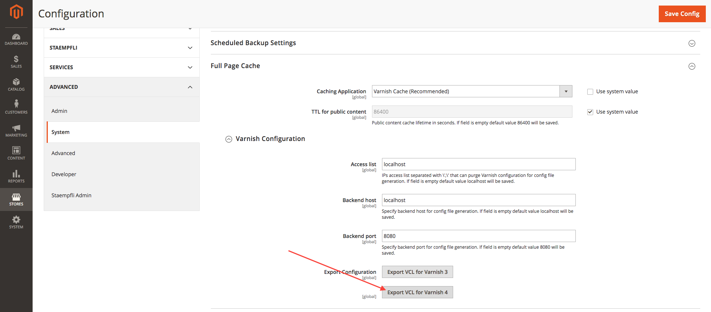

When you want to use Varnish together with Magento 2 there is already a Configuration Guide on how to [Configure and use Varnish](http://devdocs.magento.com/guides/v2.0/config-guide/varnish/config-varnish.html) provided by Magento. But there are two points which aren’t covered in the [Devdocs](http://devdocs.magento.com/). 

## Varnish does not support SSL
It's mentioned in the Devdocs as a known issue that you can't use Varnish together with SSL, at least not without SSL termination, but they don’t provide any further information on how to solve this issue.

## Varnish on Port 80
The second point who bothered me is that [they do recommend](http://devdocs.magento.com/guides/v2.0/config-guide/varnish/config-varnish-configure.html#config-varnish-config-sysvcl) to use Varnish on Port 80 (the default HTTP port) so Varnish responds directly to the incoming HTTP requests and not the Webserver. 

At least since end of January 2017 this is a bad idea as Chrome and Firefox will warn you that your Shop is insecure when you use HTTP. 

Of course you can force Magento to use HTTPS by configuration, but even then, the very first request on your Magento installation when entering the URL in your Browser is usually completed over HTTP.

## How to solve
First let's assume that Varnish and Nginx are installed and Varnish is running on the default Port 6081 and Magento on Port 80.
Now Let's start by configuring the backend for Varnish in Nginx. As suggested in the Devdocs we can use port 8080 (or any other available listen port).

### Varnish Backend
````bash
server {
  server_name {SERVERNAMES};
  listen 8080;
   set $MAGE_ROOT /home/{USER}/public_html/magento;
   set $MAGE_MODE production;
   set $MAGE_RUN_TYPE null;
   set $MAGE_RUN_CODE null;
   set $HTTPS_FORWARD on;
   set $FPM_USER {USER};
  # access and error logging for this vhost by using the logwatch logformat
  access_log /home/{USER}/log/nginx/access.log logwatch;
  error_log /home/{USER}/log/nginx/error.log error;
  location ~ \.php$ {
    fastcgi_pass unix:/var/run/{USER}.sock;
    include include.d/fastcgi_magento2.conf;
  }
  include include.d/magento2.conf;
}
````
As you may have noticed, there are some variables and placeholders in the nginx config. Some of them like the **USER**, **DOMAINS** and **DOMAIN** placeholders are depending on your server setup and can be changed to your specific needs.

The **MAGE_X**, **$HTTPS_FORWARD** and **$FPM_USER** specific variables are used in the `include.d/magento2.conf` file, which is basically the [nginx.conf.sample](https://github.com/magento/magento2/blob/develop/nginx.conf.sample#L163) file coming within every Magento 2 installation. In this case we extended the default configuration by a few lines, so it’s possible to define the run type and run code as well as the https forwarding.

The modifications for the additional variables [starts from line 163, based on the original nginx.conf.sample file.](https://github.com/magento/magento2/blob/develop/nginx.conf.sample#L163)

**Original**
````bash
# PHP entry point for main application
location ~ (index|get|static|report|404|503)\.php$ {
    try_files $uri =404;
    fastcgi_pass   fastcgi_backend;
    fastcgi_buffers 1024 4k;

    fastcgi_param  PHP_FLAG  "session.auto_start=off \n suhosin.session.cryptua=off";
    fastcgi_param  PHP_VALUE "memory_limit=768M \n max_execution_time=18000";
    fastcgi_read_timeout 600s;
    fastcgi_connect_timeout 600s;

    fastcgi_index  index.php;
    fastcgi_param  SCRIPT_FILENAME  $document_root$fastcgi_script_name;
    include        fastcgi_params;
}
````

**Modified**
````bash
location ~ (index|get|static|report|404|503)\.php$ {
    try_files $uri =404;
    fastcgi_pass   unix:/var/run/$FPM_USER.sock;

    fastcgi_param  PHP_FLAG  "session.auto_start=off \n suhosin.session.cryptua=off";
    fastcgi_param  PHP_VALUE "memory_limit=768M \n max_execution_time=18000";
    fastcgi_read_timeout 600s;
    fastcgi_connect_timeout 600s;
    fastcgi_param  MAGE_MODE $MAGE_MODE;
    fastcgi_param  MAGE_RUN_TYPE $MAGE_RUN_TYPE;
    fastcgi_param  MAGE_RUN_CODE $MAGE_RUN_CODE;
    fastcgi_param HTTPS $HTTPS_FORWARD;

    fastcgi_index  index.php;
    fastcgi_param  SCRIPT_FILENAME  $document_root$fastcgi_script_name;
    include        fastcgi_params;
}
````

The next step will be to configure Magento by creating the varnish.vcl configuration from the Backend and to store it to `/etc/varnish/default.vcl` on your server.


If this is done, create the configuration for the SSL termination in Nginx.

### HTTPS termination & Varnish proxy
````bash
server {
    listen 443 ssl;
    server_name {DOMAINS};
    ssl on;
    ssl_certificate /etc/letsencrypt/live/{DOMAIN}/fullchain.pem;
    ssl_certificate_key /etc/letsencrypt/live/{DOMAIN}/privkey.pem;
    ssl_protocols              TLSv1 TLSv1.1 TLSv1.2;
    ssl_ciphers               'AES128+EECDH:AES128+EDH:!aNULL';
    keepalive_timeout 300s;
    location / {
        proxy_pass http://127.0.0.1:6081;
        proxy_set_header X-Real-IP  $remote_addr;
        proxy_set_header X-Forwarded-For $proxy_add_x_forwarded_for;
        proxy_set_header X-Forwarded-Proto https;
        proxy_set_header X-Forwarded-Port 443;
        proxy_set_header Host $host;
    }
}
````

Now restart Nginx and Varnish and check if everything works as expected. If all is configured correctly you should be able to access your Magento installation by HTTP (without Varnish) and by HTTPS (with varnish). 

The last step will be to make sure that Magento is only accessible by HTTPS. In order to achieve this we forward all requests which comes from HTTP to HTTPS.

````bash
server {
  listen 80;
  server_name {DOMAINS};
  return 301 https://$host$request_uri;
}
````
Thus, the entire communication will now be carried over HTTPS.


