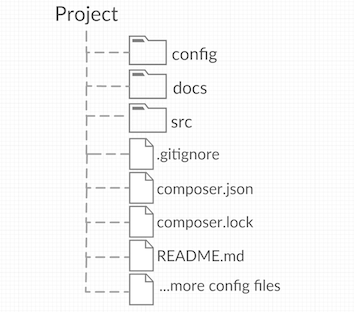
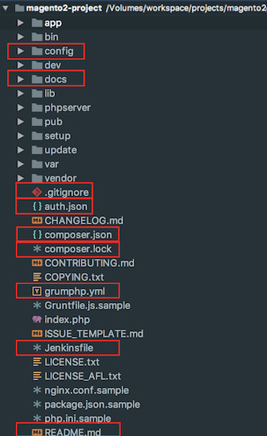
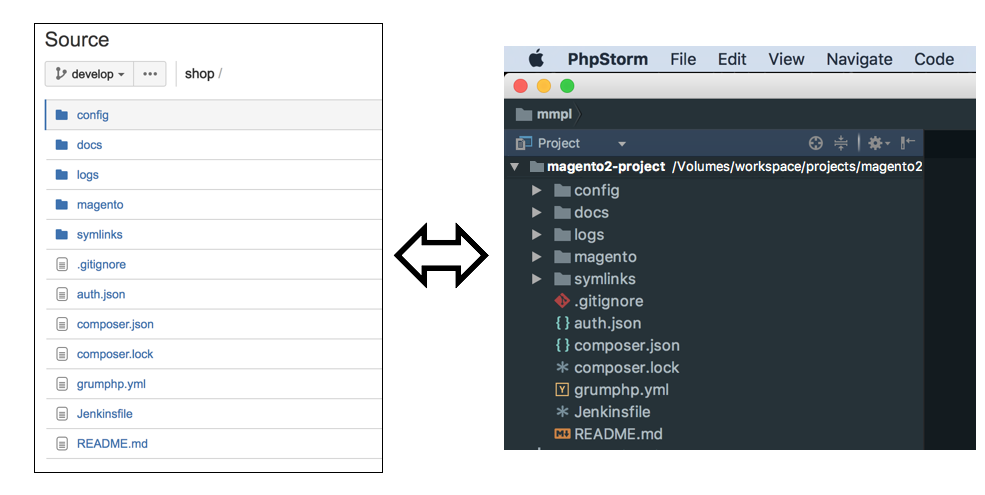
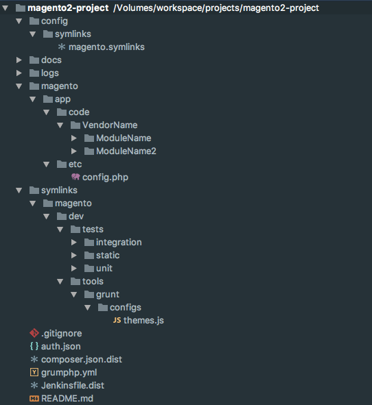

<span class="guest">This is a guest blog post by [Juan Alonso](https://twitter.com/Jalogut), he is a 2x Magento Certified Application Engineer at [Stämpfli AG](http://www.staempfli.com/leistungen/online-shops/)</span>

## Goals

When thinking about how to setup your Magento 2 projects, you should have the following goals:

* Simple repository structure
* Only the project files under version control
* Easily identify on local installations which files belong to the repo and which ones are installed by composer

These goals are very important in order to keep the repository light weight, well organized and simple for developers to know which files are under VCS.

That said, we will want something like in this image.



We will also expect the same result locally after installing all external dependencies and the Magento 2 project files.

## Wrong Magento Docs

If you simple follow the [Magento Docs](http://devdocs.magento.com/guides/v2.2/install-gde/prereq/integrator_install_ce.html), they will tell you to run:

```bash
composer require magento/project-community-edition
``` 

This configuration alone is not enough because you end up with something like that locally.



As you can see, there are lots of Magento files installed in your project root. Only the ones in the red are coming from the project repository. This solution is not valid for us because developers cannot clearly see which files are under version control and which ones where installed by composer. `.gitignore` is also quite complex as you need to ignore several individual files installed by composer out of the vendor folder.

## Proper Configuration

In order to improve that, we take a slightly different approach:

1. Enclose all Magento files and dependencies under a specific folder, so they do not pollute your project root directory. In our case, we decided to call that folder `magento`.

	For that, you only need to add `magento/` prefix path in a couple of places of your `composer.json`:

	```json
  	"config": {
  		"vendor-dir": "magento/vendor"
  	},
  	"extra": {
  		"magento-root-dir": "magento/"
  	},
  	"autoload": {
    	"psr-4": {
      		"Magento\\Setup\\": "magento/setup/src/Magento/Setup/"
    	},
    	"psr-0": {
      		"": "magento/app/code/"
    	},
    	"files": [
      		"magento/app/etc/NonComposerComponentRegistration.php"
    	]
  	},
  	"autoload-dev": {
    	"psr-4": {
      		"Magento\\Sniffs\\": "magento/dev/tests/static/framework/Magento/Sniffs/",
      		"Magento\\Tools\\": "magento/dev/tools/Magento/Tools/",
      		"Magento\\Tools\\Sanity\\": "magento/dev/build/publication/sanity/Magento/Tools/Sanity/",
      		"Magento\\TestFramework\\Inspection\\": "magento/dev/tests/static/framework/Magento/TestFramework/Inspection/",
      		"Magento\\TestFramework\\Utility\\": "magento/dev/tests/static/framework/Magento/TestFramework/Utility/"
    	}
  	}
	```

2. `.gitignore` is also much simpler now. You only need to ignore the `magento` folder except your project specific files inside `magento/app` and your `magento/app/etc/config.php`:

	```bash
	# Ignore all Magento code files except our code in "magento/app"
	/magento/*
	!/magento/app
	/magento/app/etc/*
	!/magento/app/etc/config.php
	/magento/app/code/Magento
	/magento/app/design/*/Magento
	/magento/app/i18n/magento
	/magento/app/*.*
	```

3. Symlink `composer.json` and `composer.lock` files inside `magento` folder. For some strange reasons, Magento console needs the `composer` files under the same directory as the Magento root files. With this setup that is no longer the case, so you need to symlink these files after the `composer install/update` commands:

	```json
	"scripts": {
   		"symlinkComposerFilesToMagentoRoot": "cd magento && ln -sf ../composer.* .",
   		"post-install-cmd": [
   			"@symlinkComposerFilesToMagentoRoot"
    	],
    	"post-update-cmd": [
      		"@symlinkComposerFilesToMagentoRoot"
    	]
  	}
	```
	
4. Just mention that now your server `DocumentRoot` configuration must point to `<project_path>/magento/pub`

## Result

Now, if you execute `composer install` in a clean folder you should get all composer files installed under the `magento` folder. 

Great! isn't it? Now the local installation looks much cleaner and exactly the same as our repository.




## Extra tip

If you want to be smarter, you could use a tool called [symlinker-pro](https://github.com/staempfli/symlinker-pro) for adding your symlinks after `composer install/update`. Using this tool has following advantages:

* Symlinks configuration centralized in one file
* Possible to overwrite Magento default config files with your project specific configuration. For example:
	*  `magento/dev/integration/phpunit.xml`
	*  `magento/dev/unit/phpunit.xml`
	*  `magento/dev/tools/grunt/configs/themes.js`

In our case, we configure this tool to symlink every file inside our `symlinks`  folder to the original `magento` directory.

## Summary and Files Overview

After applying these configurations our setup and files will look like that:

### Project Structure



### magento.symlinks

```bash
composer.json=>magento/composer.json
composer.lock=>magento/composer.lock

symlinks/magento/**=>magento
```

### composer.json

```json
{
  "name": "project/magento2-project-name",
  "description": "Magento Project Name",
  "type": "project",
  "license": [
    "proprietary"
  ],
  "authors": [
    {
      "name": "Your name",
      "email": "your.name@domain.com"
    }
  ],
  "config": {
    "vendor-dir": "magento/vendor",
    "use-include-path": true
  },
  "repositories": [
    {"type": "composer", "url": "https://repo.magento.com/"}
  ],
  "require": {
    "n98/magerun2": "^1.4",
    "magento/product-community-edition": "*",
    "composer/composer": "@alpha",
    "staempfli/symlinker-pro": "~1.0"
  },
  "require-dev": {
    "phpunit/phpunit": "^4.1"
  },
  "extra": {
    "magento-root-dir": "magento/",
    "magento-force": "override"
  },
  "autoload": {
    "psr-4": {
      "Magento\\Setup\\": "magento/setup/src/Magento/Setup/"
    },
    "psr-0": {
      "": "magento/app/code/"
    },
    "files": [
      "magento/app/etc/NonComposerComponentRegistration.php"
    ]
  },
  "autoload-dev": {
    "psr-4": {
      "Magento\\Sniffs\\": "magento/dev/tests/static/framework/Magento/Sniffs/",
      "Magento\\Tools\\": "magento/dev/tools/Magento/Tools/",
      "Magento\\Tools\\Sanity\\": "magento/dev/build/publication/sanity/Magento/Tools/Sanity/",
      "Magento\\TestFramework\\Inspection\\": "magento/dev/tests/static/framework/Magento/TestFramework/Inspection/",
      "Magento\\TestFramework\\Utility\\": "magento/dev/tests/static/framework/Magento/TestFramework/Utility/"
    }
  },
  "scripts": {
    "preventRunningComposerInMagentoFolder": "[ ! $(basename `pwd`) = 'magento' ] || { echo 'Checking current dir is not magento folder'; exit 1; }",
    "setPermissionsBin": "chmod -R +x bin magento/vendor/bin",
    "setSymlinks": "magento/vendor/bin/symlinker-pro create:from:file config/symlinks/magento.symlinks -f --enable-wildcards",
    "pre-install-cmd": [
        "@preventRunningComposerInMagentoFolder"
    ],
    "pre-update-cmd": [
        "@preventRunningComposerInMagentoFolder"
    ],
    "post-install-cmd": [
        "@setPermissionsBin",
        "@setSymlinks"
    ],
    "post-update-cmd": [
        "@setPermissionsBin",
        "@setSymlinks"
    ]
  }
}
```

### .gitignore

```bash
.idea
.DS_Store

# Ignore all Magento code files except our code in "magento/app"
/magento/*
!/magento/app
/magento/app/etc/*
!/magento/app/etc/config.php
/magento/app/code/Magento
/magento/app/design/*/Magento
/magento/app/i18n/magento
/magento/app/*.*
```


